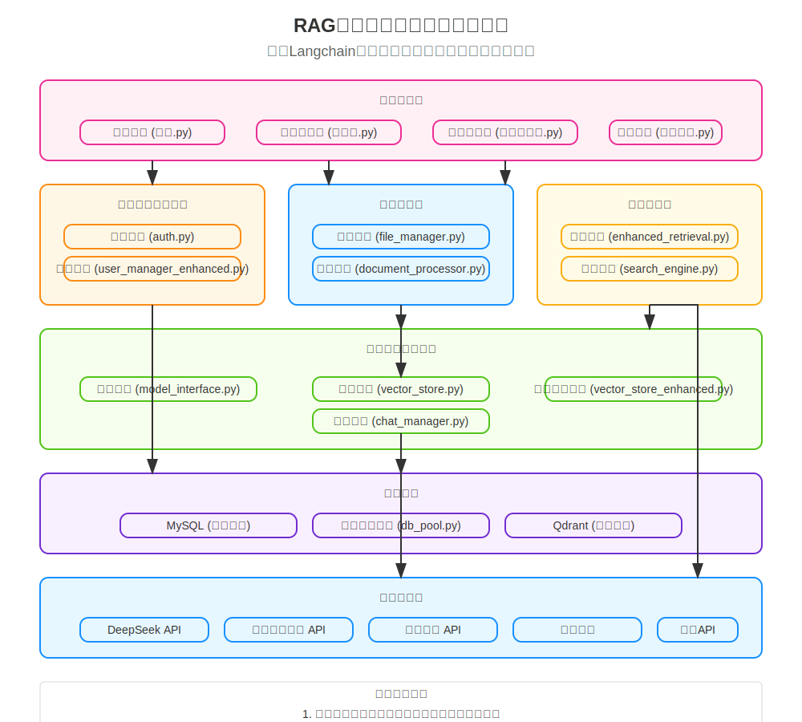

# RAG智能文档检索系统

## 项目概述
本项目是一个基于RAG（检索增强生成）技术的智能文档检索系统，集成了用户认证、文档处理和向量检索等功能，为用户提供高效的文档管理和智能问答服务。

## 系统架构



### 核心模块
- **用户认证模块**：提供用户注册、登录、密码重置等功能
- **文档处理模块**：支持文档上传、解析和向量化
- **检索模块**：实现基于向量数据库的智能文档检索
- **Web界面**：基于Streamlit构建的用户友好界面

### 技术栈
- **前端框架**：Streamlit
- **后端语言**：Python
- **数据存储**：
  - MySQL：用户数据和文档元数据
  - 向量数据库：文档向量存储
- **核心依赖**：
  - 文档处理：document_processor.py, document_processor_async.py
  - 用户管理：user_manager.py, user_manager_enhanced.py, user_profile.py
  - 向量存储：vector_store.py, vector_store_enhanced.py
  - 认证服务：auth.py, email_verification.py, email_verification_enhanced.py
  - 聊天管理：chat_manager.py
  - 检索增强：enhanced_retrieval.py

## 目录结构
```
├── modules/                 # 核心功能模块
│   ├── auth/               # 认证相关模块
│   ├── document/           # 文档处理模块
│   ├── vector_store.py     # 向量存储实现
│   ├── document_processor.py # 文档处理实现
│   ├── user_manager.py     # 用户管理实现
│   ├── chat_manager.py     # 聊天管理实现
│   └── enhanced_retrieval.py # 增强检索实现
├── pages/                  # Web页面
│   ├── 主页面.py           # 主应用页面
│   ├── 管理员面板.py       # 管理面板
│   ├── 个人资料.py         # 用户资料页面
│   ├── 密码重置.py         # 密码重置页面
│   └── style.css           # 样式文件
├── 登录.py                 # 登录入口
└── uploads/                # 文档上传目录
```

## 功能特性

### 用户功能
- 账户管理：注册、登录、密码重置
- 文档管理：上传、查看、删除
- 智能问答：基于文档内容的问答交互
- 个人资料：查看和编辑个人信息
- 主题切换：支持明暗主题切换
- 实时问答：流式响应的智能对话体验

### 管理功能
- 用户管理：查看、编辑用户信息
- 系统监控：查看系统运行状态
- 文档审核：管理用户上传的文档

### 界面特性
- 响应式设计：适配不同设备
- 动画效果：流畅的交互体验
- 拖拽上传：便捷的文件处理
- 主题切换：支持明暗主题模式
- 个性化设置：用户界面偏好保存

## 部署说明

### 环境要求
- Python 3.10+
- MySQL 5.7+
- 向量数据库服务

### 安装步骤
1. 克隆项目代码
2. 安装依赖：`pip install -r requirements.txt`
3. 配置数据库连接
4. 运行初始化脚本：`python check_db_structure.py`
5. 启动应用：`streamlit run 登录.py`

## 使用指南

### 用户指南
1. 注册/登录系统
2. 上传待检索的文档
3. 在问答界面输入问题
4. 获取基于文档的智能回答

### 管理员指南
1. 使用管理员账户登录
2. 访问管理面板
3. 管理用户和文档
4. 监控系统状态

## 安全特性
- 密码加密存储：使用安全哈希算法
- 邮箱验证：email_verification_enhanced.py
- 文件类型限制：file_manager.py
- 访问权限控制：基于角色的权限系统
- 会话管理：安全的用户会话控制
- 输入验证：防止恶意输入和注入攻击

## 性能优化
- 异步文档处理：document_processor_async.py
- 向量检索优化：enhanced_retrieval.py
- 页面加载优化：animations.js和animations.css
- 数据库连接池：db_pool.py
- 流式响应：实时问答体验